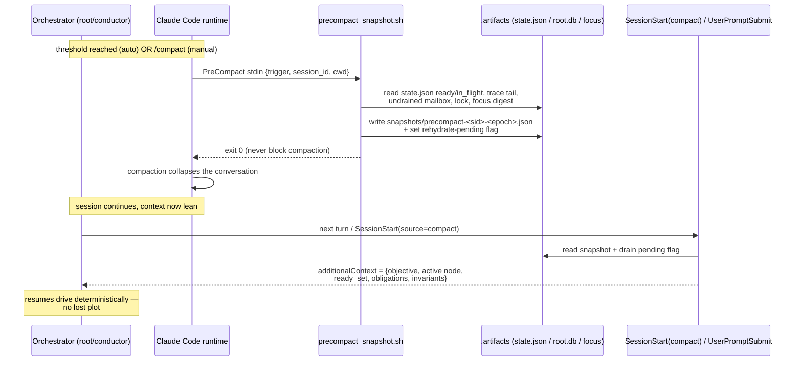
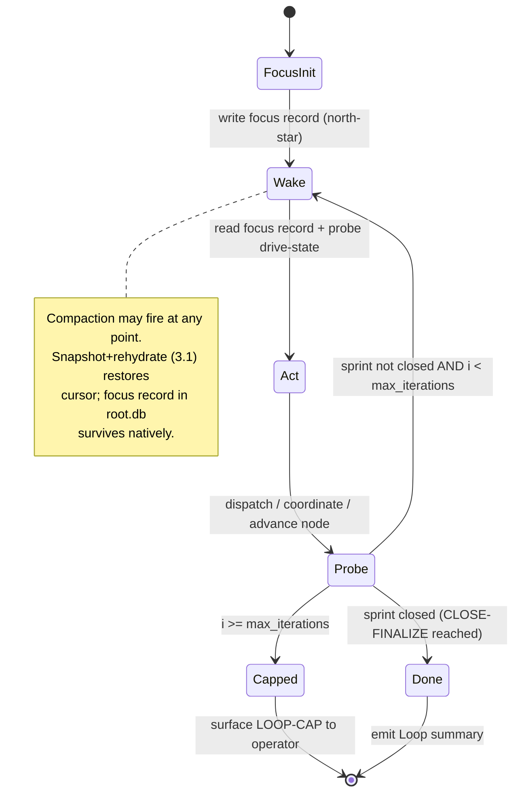
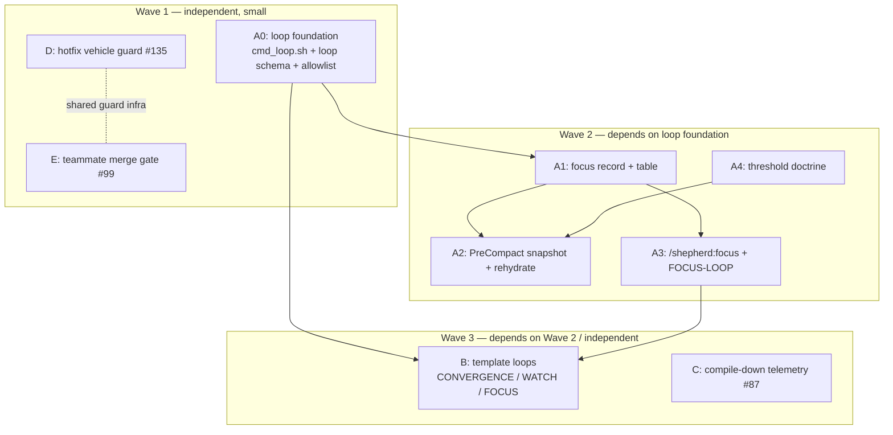
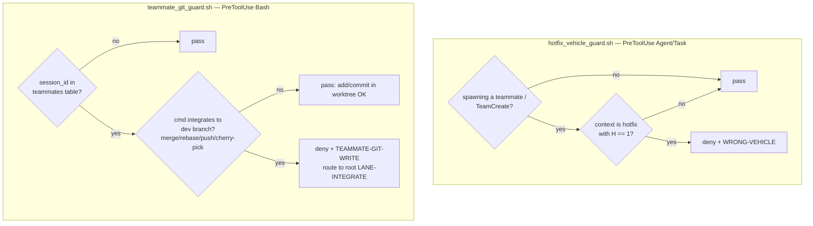
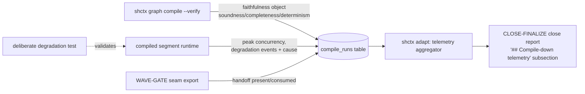

# v6.0.9 Design Spec — Focus Loop, Compaction Resilience, Template Loops, Telemetry, and Two Enforcement Guards

- **Status:** DRAFT for operator review (pre-seed). Not yet a plan; not yet dispatched.
- **Author:** root design session (Opus), 2026-06-09. Baseline gathered by Sonnet research lanes.
- **Branch:** `v6.0.9` (in-flight; only the version bump + housekeeping have landed; CHANGELOG has no v6.0.9 section yet).
- **Namespace:** `.artifacts/` (this repo + the axiom consumer both run on a pre-existing `.artifacts/` tree — honor it; never hardcode either literal, always go through `resolve_namespace` / `resolve_workdir`, GH #121).
- **Convertible to:** a `/shepherd:plant` seed once approved.

---

## 0. Orientation & the three load-bearing discoveries

Five work items are bundled into v6.0.9:

| # | Item | Source | Weight |
|---|------|--------|--------|
| A | **Focus Loop + compaction resilience** | #134 | Large (centerpiece) |
| B | **Template loops** (named Pattern-6 composites) | operator | Medium |
| C | **Compile-down telemetry close-report** | #87 | Medium |
| D | **Hotfix cardinality guard** | #135 | Small |
| E | **Teammate merge gate** (root-only integration) | operator + #99 | Small–Medium |

Before any design, three findings from the baseline audit change what is and isn't possible. They are load-bearing — if any is wrong, the affected item's design is invalidated.

**Discovery 1 — `shctx loop` is documented but NOT implemented.** `/shepherd:loop` (shipped v6.0.7) and the CHANGELOG both reference `shctx loop init|record|close|status|list`. There is no `cmd_loop.sh`, no `loop` entry in the `shctx` dispatcher allowlist, and no `loop` table in `skills/context/schema/`. **The "SQLite-backed loop state" claim is currently aspirational.** Items A and B depend on persistent loop state surviving compaction, so v6.0.9 must *build the loop foundation first*. This is the single biggest scope correction versus the naive read.

**Discovery 2 — an agent cannot trigger its own compaction, and cannot read its own context budget.** Verified against official Claude Code docs (v2.1.x):
- There is **no** tool, slash command, SDK call, or hook return value that lets the assistant initiate `/compact`. Compaction is user-triggered or system-automatic only.
- `/context` is **display-only** — no env var, file, or machine-readable surface exposes live token-percent to a hook or the model.
- The **only** official auto-compaction tuning knob is the env var `CLAUDE_AUTOCOMPACT_PCT_OVERRIDE` (1–100, settable in `settings.json` under `env`). There is **no** per-model threshold and **no** documented disable toggle.

The literal feature the operator asked for — *"an agent that plans its own compaction to coincide with dispatched work"* — **is not buildable.** What *is* buildable captures the intent and is specified in Item A: make compaction **safe** (snapshot + rehydrate) and **earlier/predictable** (threshold), rather than **timed** (impossible).

**Discovery 3 — #135 and the teammate-merge ask are both "prose-only invariant, no mechanical guard" defects.** The hotfix cardinality ladder (`doctrines/hotfix-dispatch.md`, v6.0.8) is doctrine-complete and correct; what's missing is enforcement. Identically, teammate-conductors are *told* not to write git (`agents/conductor.md` TEAMMATE mode) yet #99 observed a teammate attempting a rebase. Both are fixed by the same mechanism class: a deterministic `PreToolUse` guard hook plus a registered halt code. Items D and E share infrastructure.

---

## Pass 1 — Goals & Deliverables

"Done" stated in concrete, checkable terms per item. Each acceptance line is independently verifiable.

### Item A — Focus Loop + compaction resilience (#134)

The Focus Loop is a long-horizon orientation loop the orchestrator (root or solo conductor) runs across a sprint so it never loses the plot — across compaction events and across sprint duration. It is Pattern 6 (Loop-Until-Done) specialized to the orchestrator's own drive, keyed off a durable **focus record**.

Deliverables:
1. **Loop foundation** (prerequisite, closes Discovery 1): `skills/context/scripts/cmd_loop.sh` + a `loop` schema migration + `loop` added to the `shctx` dispatcher allowlist, implementing the five verbs `/shepherd:loop` already calls (`init|status|record|close|list`).
2. **Focus record**: a durable, canonical north-star artifact per sprint — objective, active Stage-Graph node, outstanding obligations, invariants-to-hold — written/updated at each major phase boundary. Home: a `focus` table in the registry (canonical, survives compaction) with a denormalized one-shot digest at `<ns>/focus/<sprint>.json`.
3. **PreCompact snapshot hook** `hooks/scripts/precompact_snapshot.sh`: on any compaction (manual or auto), capture the filesystem graph cursor (`state.json` `ready`/`in_flight` sets), the trace tail, undrained mailbox, lock, and the focus digest into `<ns>/snapshots/precompact-<session>-<epoch>.json`, and set a rehydration-pending flag.
4. **Rehydration**: after compaction, re-inject the snapshot digest as `additionalContext` so the orchestrator resumes its drive deterministically. Primary path: `SessionStart` consumer keyed on `source == "compact"`; guaranteed fallback: a `UserPromptSubmit` consumer that drains the rehydration-pending flag once.
5. **Threshold doctrine**: a documented, opt-in `CLAUDE_AUTOCOMPACT_PCT_OVERRIDE` recommendation for Sonnet-root sessions (compact earlier so it fires at a natural wave boundary instead of at 95% panic), surfaced in `docs/configuration.md` and gated via `shepherd.toml [compaction]`.
6. **`/shepherd:focus` command** (or `/shepherd:loop --mode=focus`): start/refresh the focus loop; interval mode delegates to the native `/loop` for long-horizon wake cadence (this also lands the wall-clock cadence deferred in #113).

Acceptance:
- `shctx loop init|status|record|close|list` execute against `.artifacts/root.db` and round-trip a loop lifecycle (init → 2 records → close) with a passing test in `skills/context/tests/`.
- Forcing a `/compact` mid-sprint, then issuing any next prompt, yields an `additionalContext` injection that names the active node, ready-set, and outstanding obligations — verified by a hook test that simulates the PreCompact stdin (`trigger: manual`) then the rehydration event.
- The focus record is updated at SEED-VERIFY, each WAVE-GATE, and CLOSE-FINALIZE (observable rows in the `focus` table).
- `docs/configuration.md` documents the threshold env var with the honest caveat that it is the *only* official knob and is global, not per-model.

### Item B — Template loops (named Pattern-6 composites)

Give the operator reusable, parameterized, circuit-broken loop templates that slot into the existing six-pattern + composite structure — the loop analogue of the existing Pattern-2 composites (`INTRO-COMBO-WAVE`, `DISCOVERY-COMBO-WAVE`, `HOTFIX-BATCH`).

Deliverables:
1. Three named composites with `Pattern basis = Pattern 6` (the first such in the repo), authored into `skills/shepherd/references/workflow-templates.md` matching the existing per-pattern subsection skeleton (ASCII diagram / When to use / Flock binding / Stage Graph shape / Compose notes / Anti-patterns):
   - **`FOCUS-LOOP`** — orchestrator self-orientation (Item A's runtime shape).
   - **`CONVERGENCE-LOOP`** — gate-rerun-until-green (generalizes the `H ≥ 6` HOT-FIX lane loop and the fix-until-gates-green idiom).
   - **`WATCH-LOOP`** — interval monitoring via native `/loop` (deploy/Sentry watch; the bounded `@worker` monitoring pattern).
2. Doctrine updates in `skills/shepherd/doctrines/workflow-patterns.md`: add the three to the named-composite table; confirm each respects the composition grammar (Loop-OUTER only — the existing illegal row forbids Loop nested *inside* a fanout iteration body); no new halt codes needed (they reuse `LOOP-*`).

Acceptance:
- Each composite has all six subsections and a valid Stage Graph YAML shape that `shctx plan extract` parses without error (dry-run against a fixture plan).
- `workflow-patterns.md` selection tree and composition grammar remain internally consistent (no composite implies an illegal nesting).
- Each composite declares a mandatory `max_iterations`.

### Item C — Compile-down telemetry close-report (#87)

Make compile-down pilot feedback measurable instead of anecdotal.

Deliverables:
1. A `compile_runs` (or `segment_metrics`) schema migration capturing, per compiled segment per run: segment count + size, peak concurrency vs the global ceiling, §IV faithfulness-diff result (the structured object `shctx graph compile --verify` already emits), seam-handoff outcome, and every degradation-to-direct-dispatch event with cause.
2. A close-report subsection (mirroring the existing `## Cache telemetry` subsection precedent over `v_cache_usage`) emitted at CLOSE-FINALIZE, fed by a new `shctx adapt`/`graph` aggregator over the new table — built on the *live* `shctx adapt` surface, **not** the dead `shctx graph trends` reference (which `dispatch-cascade.md §VII` cites but which was never implemented).
3. A **deliberately-triggered degradation test**: inject a segment runtime failure and confirm the conductor's direct-dispatch fallback recovers it (the acceptance clause #87 explicitly calls out as the real risk).
4. Fix the dangling `shctx graph trends` reference in `dispatch-cascade.md §VII` (either implement it as a thin alias or repoint it at `shctx adapt report --trends`).

Acceptance:
- After a compile-down run, the `.artifacts/reports/` close report contains: segment count/sizes, peak concurrency, per-segment §IV pass/fail, seam outcomes, and degradation events.
- The degradation path has a passing, intentionally-triggered test in `skills/context/tests/` (not just a prose acceptance clause).
- No dead `shctx graph trends` reference remains in the doctrines.

### Item D — Hotfix cardinality guard (#135)

Mechanically enforce the existing, correct ladder: `H = 1` → one subagent, never a teammate.

Deliverables:
1. `hooks/scripts/hotfix_vehicle_guard.sh` — a `PreToolUse(Agent|Task)` guard that denies a teammate/`TeamCreate` spawn whose context is a single-cluster hotfix (`H = 1`), emitting `WRONG-VEHICLE`.
2. Register `WRONG-VEHICLE` as a first-class halt code in the halt-code tables of `agents/conductor.md` and `agents/shepherd.md`.
3. No doctrine rewrite — `hotfix-dispatch.md` is already complete.

Acceptance:
- A simulated `H = 1` teammate spawn is denied with `WRONG-VEHICLE`; an `H ∈ (1,5]` batched-workflow dispatch and an `H ≥ 6` lane spawn both pass — covered by a hook test.
- `WRONG-VEHICLE` appears in both halt-code tables.

### Item E — Teammate merge gate (root-only integration)

Team-based conductors must never integrate their own worktree into the dev branch. Integration becomes a root-exclusive, **reviewed** decision.

Deliverables:
1. `hooks/scripts/teammate_git_guard.sh` — a `PreToolUse(Bash)` guard that, when the current `session_id` matches a non-retired row in the `teammates` table, denies dev-branch integration commands (`git merge`, `git rebase` onto a shared branch, `git push`, `git cherry-pick` onto the dev branch) while permitting in-worktree `git add`/`git commit`. Emits `TEAMMATE-GIT-WRITE` (the code already named in #99).
2. A **`LANE-INTEGRATE`** seam in the pipeline: a root-owned step where root (optionally via an `@auditor` diff-review concern) inspects a completed lane's diff *before* merging it into the dev branch. Authored into `skills/shepherd/pipeline.md` and `agents/shepherd.md`.
3. Doctrine: a short `doctrines/teammate-integration-authority.md` (or an addendum to `dispatch-tier-separation.md`) stating integration authority is root-exclusive and review-gated.

Acceptance:
- A teammate session attempting `git merge`/`git push` to the dev branch is denied with `TEAMMATE-GIT-WRITE`; the same commands from the root session pass — covered by a hook test that stubs a `teammates` row matching/not-matching the session id.
- In-worktree `git add`/`git commit` from a teammate still pass (no false-positive on legitimate lane commits).
- The pipeline documents `LANE-INTEGRATE` as a root-owned, review-before-merge seam.

---

## Pass 2 — Assumptions & Constraints

Load-bearing assumptions are marked **[LB]** — if false, the dependent design fails. Genuine unknowns are marked **[?]** and carry a verification action.

### Verified Claude Code capability matrix (the hard constraints)

| Capability | Verdict | Mechanism / Note |
|-----------|---------|------------------|
| Agent self-triggers `/compact` | **NOT SUPPORTED** | No tool/command/SDK/hook affordance. Kills the literal Item-A ask. |
| Read live context % from a hook/agent | **NOT SUPPORTED** | `/context` is display-only; no machine-readable surface. So guards cannot branch on "how full am I." |
| Lower auto-compact threshold | **SUPPORTED (global only)** | `CLAUDE_AUTOCOMPACT_PCT_OVERRIDE` (1–100) in `settings.json` `env`. **No per-model form, no disable toggle.** |
| `PreCompact` hook | **SUPPORTED** | `type: command`; stdin `{session_id, transcript_path, cwd, trigger: manual\|auto, custom_instructions}`; can block via exit 2 / `{"decision":"block"}`. |
| Steer the auto-compaction *summary* | **NOT SUPPORTED** | `custom_instructions` is empty on auto-trigger (CC issue #14160). We cannot tell the summarizer "keep X." → snapshot-to-file + rehydrate is the *only* viable preservation path. |
| `SessionStart` source `== compact` | **[?]** | Strongly expected (CC documents `startup\|resume\|clear\|compact`). Verify during impl; design ships a guaranteed `UserPromptSubmit` fallback so Item A does not depend on it. |
| Native `/loop` skill | **SUPPORTED** | Session-scoped, cron-based, auto-expires after 3 days, can invoke a slash command each iteration (`/loop 20m /shepherd:loop --resume <id>`). |

### Per-item assumptions

- **[LB] Discovery 1 holds:** `shctx loop` has no backing. Item A and B must ship `cmd_loop.sh` + schema first. (Verified by grep: no `cmd_loop.sh`, `loop` absent from the `shctx` allowlist, no `loop` DDL.)
- **[LB]** The registry (`root.db`) is **canonical and survives compaction** — compaction only truncates the *conversation*, not the filesystem. So the focus record and loop state in SQLite persist for free; the snapshot's real job is to recover the *in-context* drive cursor and hand the model a one-shot rehydration digest. (This is why we snapshot `state.json`'s ready/in_flight cursor specifically — it is the part the model holds in its head.)
- **[LB]** A `PreToolUse` hook receives `session_id` on stdin, and a teammate session's `session_id` is recorded in the `teammates` table (`0007_canonical_state.sql`). Item E's guard keys off this. (Verified: `teammates.session_id` column exists; `coordinate_drive_guard.sh` already reads the table by session.)
- **[LB]** Hotfix cluster count `H` is the file-disjoint partition computed at `pipeline.md §XIII-bis`. Item D's guard must read that same partition (or a marker the walk writes) to know `H = 1`. **[?]** the guard's access to `H` at `PreToolUse(Agent)` time — if the partition isn't yet materialized when the spawn fires, the guard needs a cheap proxy (e.g., a `hotfix.context.json` the walk writes before dispatch). Verify the ordering during impl; fall back to denying *any* teammate spawn tagged `hotfix` with cluster-count ≤ 1 in a marker file.
- **[?] SessionStart-compact** (above) — verification action: a 5-line probe hook logging `source` across a forced compaction.
- **Constraint:** all new hook scripts must follow house style — `set -uo pipefail`, source `_lib.sh || exit 0`, read stdin via `json_field`, **exit 0 always** (decisions via stdout JSON), config-gate via the `shepherd.toml` grep idiom, runaway-cap via a `<ns>/tmp/*.count` file (2-nudge precedent), and `log_event` every decision.
- **Constraint:** no new flock agents (the six-lane flock is closed). All new behavior is hooks + shctx subcommands + doctrine + commands. The Focus Loop's "iterator" is the orchestrator itself or a `@discovery`/`@worker` — no new role.
- **Constraint:** version-source sync — any version-bearing change must move `plugin.json`, both `marketplace.json` keys, both SKILL.md frontmatters, `README.md`, and a hand-authored `CHANGELOG.md` v6.0.9 section together (`shctx release` automates the five non-CHANGELOG files).

### Scope boundaries (out of scope for v6.0.9)

- Per-model compaction thresholds (CC doesn't support it — would require an upstream feature).
- Steering compaction summary content (CC issue #14160 — not us to fix).
- `PostCompact` hook (CHANGELOG names it alongside `PreCompact` as deferred; rehydration via SessionStart/UserPromptSubmit covers the need without it).
- Plan-materialization issue tree (#27–30) and the team-comms substrate (#70) — adjacent but separate epics.

---

## Pass 3 — Structure (diagrams)

### 3.1 Compaction lifecycle — snapshot then rehydrate (Item A)

The only feasible "stay on-track through compactions" mechanism, given that the agent cannot trigger or steer compaction and cannot read its budget.



### 3.2 Focus Loop — state machine (Items A + B)

`FOCUS-LOOP` is Pattern 6 with the orchestrator as iterator and the focus record as the convergence anchor. Interval mode borrows the native `/loop` wake clock.



### 3.3 Five-item dependency DAG (sequencing)



`C` (telemetry) is independent and can ride any wave; placed in Wave 3 to keep Wave 1 lean. `D` and `E` are independent of the loop work and share the guard-hook house pattern, so they pair naturally in Wave 1.

### 3.4 Two enforcement guards — decision flow (Items D + E)



### 3.5 Compile-down telemetry data flow (Item C)



---

## Pass 4 — Show the work (derivations, interfaces, tradeoffs)

### 4.1 Why the compaction feature reduces to snapshot+rehydrate+threshold (the honest derivation)

The operator's intent decomposes into three sub-goals; each is checked against the verified capability matrix:

1. **Timing** — *"compact during the dispatch wait so the wait absorbs the cost."* The agent cannot trigger compaction (NOT SUPPORTED) and cannot read its budget (NOT SUPPORTED), so it cannot *deliberately* compact at the dispatch boundary. **Verdict: impossible.** Mitigation: the overlap the operator already observes ("await dispatch, then compact") is auto-compaction firing while teammates churn — i.e., the win already exists incidentally; we cannot make it deliberate.
2. **Predictability** — *"compact earlier, at a clean boundary, not at 95% panic."* `CLAUDE_AUTOCOMPACT_PCT_OVERRIDE` lowers the global trigger point. Setting Sonnet-root sessions to, say, 70% makes compaction fire earlier and more often at lower-context (cheaper) moments — which tend to cluster near wave boundaries where the root has just shed teammate context. **Verdict: SUPPORTED, partial** (global, not per-model; we document it as opt-in).
3. **Safety** — *"don't lose the plot when it compacts."* PreCompact snapshot + post-compaction rehydration. The registry already survives compaction; we only need to recover the in-context cursor. **Verdict: SUPPORTED, fully** — and this is exactly #134's "stay on-track through compactions."

So: the *unbuildable* third of the ask (timing) is the part with the least marginal value, because subagent/teammate context is isolated — the root's context only grows from **returned payloads**, not from the work itself. The highest-leverage move to reduce compaction *frequency* is therefore not timing at all; it is **bounding return-payload size and routing heavy reads through context-isolated `@discovery`**. That discipline already exists in doctrine; the spec reinforces it as the real lever and treats threshold + snapshot as the supporting cast.

A small quantitative sketch makes the payload point concrete. If the root window is `W` tokens and each wave returns a payload of mean size `p`, then waves-between-compactions ≈ `(τ·W − b) / p`, where `τ` is the threshold fraction and `b` the stable baseline (CLAUDE.md, skills, focus record). Halving `p` (tighter payloads) roughly **doubles** the inter-compaction interval; lowering `τ` from 0.95 to 0.70 *reduces* it by ~26% but makes each event cheaper and more predictable. The two levers trade in opposite directions — which is why the design keeps `τ` as an opt-in knob and puts the structural weight on `p` (payload discipline) and on making each compaction *safe* (snapshot) rather than *rare*. Tightening `p` is the dominant term; threshold is a predictability tuning, not a frequency fix.

### 4.2 Loop foundation — interface sketch (Item A0)

*Design intent — `@coder` owns final implementation; shapes shown for review only.*

`loop` schema (new migration, e.g. `0012_loop_state.sql`), mirroring the `sprint_metrics`/`heartbeats` conventions:

```
loops(
  id TEXT PRIMARY KEY,              -- 'loop-YYYYMMDD-NNN'
  project_id TEXT NOT NULL,         -- FK projects(id) CASCADE
  kind TEXT,                        -- 'focus' | 'convergence' | 'watch' | 'generic'
  task TEXT,
  agent TEXT,                       -- worker | discovery | orchestrator
  max_iterations INTEGER NOT NULL,
  until_field TEXT DEFAULT 'new_findings',
  interval TEXT,                    -- e.g. '5m' when delegating to native /loop
  status TEXT DEFAULT 'active',     -- active | converged | cap-reached
  created_at INTEGER NOT NULL
)
loop_iterations(
  loop_id TEXT NOT NULL,            -- FK loops(id) CASCADE
  iteration INTEGER NOT NULL,
  new_findings INTEGER,             -- 0|1
  summary TEXT,
  recorded_at INTEGER NOT NULL,
  UNIQUE(loop_id, iteration)
)
```

`cmd_loop.sh` verb surface (the five `/shepherd:loop` already calls): `init --task --max --agent --until --interval` (emits `loop-id`), `status --id`, `record --id --iteration --new_findings --summary`, `close --id --status`, `list`. Add `loop` to the `shctx` dispatcher allowlist. Optional sixth verb `focus` (read/refresh the focus record) if the focus record is co-located in this module.

### 4.3 Focus record — what it holds and why

The focus record is the **single source of orientation truth**. It is deliberately small (it must fit in one `additionalContext` injection):

```
focus(
  sprint TEXT PRIMARY KEY,
  objective TEXT,                   -- the sprint's north star, one paragraph
  active_node TEXT,                 -- current Stage-Graph node id
  ready_set TEXT,                   -- comma-joined node ids (cursor snapshot)
  obligations TEXT,                 -- JSON: open lanes, undrained mail, pending gates
  invariants TEXT,                  -- JSON: hold-true rules (e.g. 'no teammate git integration')
  updated_at INTEGER
)
```

Written at SEED-VERIFY (objective + invariants), refreshed at each WAVE-GATE (active_node + ready_set + obligations), finalized at CLOSE-FINALIZE. Because it lives in `root.db`, it survives compaction natively; the snapshot only denormalizes it (plus the live `state.json` cursor) into the one-shot rehydration digest.

### 4.4 PreCompact + rehydrate — house-style sketch (Item A2)

*Design intent only.* `precompact_snapshot.sh` follows the `coordinate_drive_guard.sh` skeleton: `set -uo pipefail` → source `_lib.sh || exit 0` → read stdin → `[compaction] precompact_snapshot` gate (`on`/`off`) → assemble snapshot from `state.json` + `trace.jsonl` tail + `mailbox` unread + `shepherd.lock` + `focus` digest → write `<ns>/snapshots/…json` → touch `<ns>/tmp/rehydrate-pending.<session>` → `log_event` → **exit 0 (never block compaction)**. Retention trimmed to `[compaction] snapshot_retention` (default 5).

Rehydration consumer (primary `SessionStart` keyed on `source==compact`; fallback `UserPromptSubmit`): if a pending flag exists for this session, read the latest snapshot, emit `{"additionalContext": "<digest>"}`, drain the flag. Runaway-bounded (drain-once). Gated by `[focus] rehydrate` (`on`/`off`).

New `shepherd.toml` sections (uniquely-named keys so the section-blind grep idiom resolves):

```toml
[compaction]
precompact_snapshot = "on"    # on (default) | off
snapshot_retention  = 5       # int

[focus]
rehydrate           = "on"    # on (default) | off
loop_max_default    = 8       # default max_iterations for FOCUS-LOOP
```

### 4.5 Tradeoffs considered and rejected

- **Per-model threshold via settings object** — *rejected:* not supported by CC (only the global env var). Documenting a per-model knob would be a lie.
- **A `PreToolUse(Agent)` hook that force-compacts before dispatch** — *rejected:* hooks cannot trigger compaction; no return value does it. This was the operator's first instinct and it is simply not exposed.
- **Steering the compaction summary via `custom_instructions`** — *rejected:* empty on auto-trigger (CC #14160). Snapshot-to-file is the only reliable preservation path.
- **Building the Focus Loop on in-session state only (skip `cmd_loop.sh`)** — *rejected:* loop state must survive compaction to be a *focus* loop; in-session state is exactly what compaction destroys. The SQLite backing is non-optional, which is why Discovery 1 promotes the loop foundation to a Wave-1 prerequisite.
- **A new `@integrator` flock agent for Item E** — *rejected:* the flock is closed at six. Integration is a root decision (existing tier), gated by an optional `@auditor` review concern — no new role.
- **Making Item D a doctrine rewrite** — *rejected:* `hotfix-dispatch.md` is already complete and correct; the defect is missing enforcement, so the fix is a guard + halt-code registration, nothing more.

---

## Sequencing → seed shape

When approved, this converts to a `/shepherd:plant` seed with three waves:

- **Wave 1 (independent, small):** A0 loop foundation (`cmd_loop.sh` + `0012_loop_state.sql` + allowlist) · D hotfix guard · E teammate merge gate. Three disjoint file-scopes; parallel-safe.
- **Wave 2 (depends on A0):** A1 focus record + table · A2 PreCompact snapshot + rehydrate consumers · A3 `/shepherd:focus` + FOCUS-LOOP runtime · A4 threshold doctrine.
- **Wave 3 (depends on Wave 2 / independent):** B template loops (CONVERGENCE/WATCH/FOCUS into `workflow-templates.md` + `workflow-patterns.md`) · C compile-down telemetry (`compile_runs` migration + aggregator + close-report + degradation test).

Each wave closes with the standard auditor swarm. The compaction-resilience hooks (A2) and both guards (D, E) each need a hook test in `hooks/tests/`; A0 and C each need a `skills/context/tests/` test.

---

## Open questions for the operator

1. **`/shepherd:focus` vs `/shepherd:loop --mode=focus`** — new top-level command, or a mode of the existing loop command? (Recommend a thin `/shepherd:focus` that wraps `loop --kind=focus` for discoverability.)
2. **Threshold default** — ship a recommended `CLAUDE_AUTOCOMPACT_PCT_OVERRIDE` for Sonnet roots (e.g. 70), or document it opt-in with no default? (Recommend opt-in + documented, since it is global and affects non-shepherd sessions too.)
3. **Item E review depth** — should `LANE-INTEGRATE` always run an `@auditor` diff-review before root merges, or only above a diff-size threshold? (Recommend size-gated: small lanes root-reviews inline, large lanes get an auditor concern.)
4. **Wave-1 width** — A0, D, E are three disjoint lanes. Comfortable running all three in parallel, or sequence A0 first since B/A depend on it?
5. **Should the dead `shctx graph trends` reference (#87 sub-item) be implemented as a real alias, or just repointed** at `shctx adapt report --trends`?

---

## Appendix — file-touch inventory (for the eventual seed)

| Item | New files | Edited files |
|------|-----------|-------------|
| A0 | `skills/context/scripts/cmd_loop.sh`, `skills/context/schema/migrations/0012_loop_state.sql`, `skills/context/tests/loop_*.sh` | `skills/context/scripts/shctx` (allowlist), `skills/context/SKILL.md` |
| A1 | `skills/context/schema/migrations/0013_focus.sql` (or fold into 0012) | `cmd_loop.sh` (focus verb), conductor/shepherd profiles (write focus at boundaries) |
| A2 | `hooks/scripts/precompact_snapshot.sh`, rehydrate consumer script, `hooks/tests/precompact_*.sh` | `hooks/hooks.json` (`PreCompact` key; `SessionStart`/`UserPromptSubmit` consumers), `hooks/scripts/_lib.sh` (if a shared snapshot helper is added) |
| A3 | `commands/focus.md` (or extend `commands/loop.md`) | `agents/conductor.md`, `agents/shepherd.md` (focus-loop drive) |
| A4 | — | `docs/configuration.md`, `examples/*/shepherd.toml` (`[compaction]`/`[focus]`) |
| B | — | `skills/shepherd/references/workflow-templates.md`, `skills/shepherd/doctrines/workflow-patterns.md` |
| C | `skills/context/schema/migrations/0014_compile_runs.sql`, degradation test | `skills/context/scripts/cmd_adapt.sh` (or `cmd_graph.sh`), `skills/shepherd/doctrines/dispatch-cascade.md` (fix dead `graph trends` ref), close-report emitter |
| D | `hooks/scripts/hotfix_vehicle_guard.sh`, `hooks/tests/hotfix_vehicle_*.sh` | `hooks/hooks.json` (`PreToolUse` Agent/Task), `agents/conductor.md`, `agents/shepherd.md` (register `WRONG-VEHICLE`) |
| E | `hooks/scripts/teammate_git_guard.sh`, `hooks/tests/teammate_git_*.sh`, `skills/shepherd/doctrines/teammate-integration-authority.md` | `hooks/hooks.json` (`PreToolUse` Bash), `skills/shepherd/pipeline.md` (`LANE-INTEGRATE` seam), `agents/shepherd.md` |
| all | — | `CHANGELOG.md` (hand-authored v6.0.9 section), version-source files via `shctx release` |

> Every code artifact above is `@coder`-owned. This spec is design-only; it commits no implementation to the runtime.
