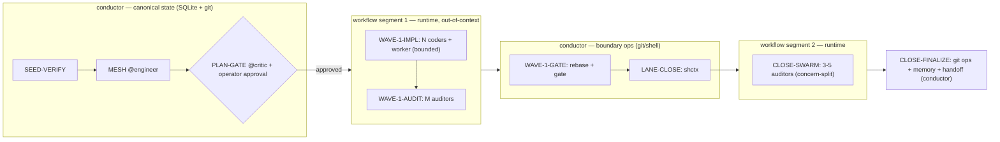

# Workflow compile-down — the Stage Graph IS the orchestration script

> **Platform feature under evaluation:** Claude Code *Dynamic Workflows*
> (research preview, requires Claude Code ≥ v2.1.154) — a JS script Claude
> writes for a task, executed by a background runtime while the session
> stays responsive; intermediate results live in script variables, not
> conversation context. It's the **top-level `Workflow` tool — NEVER a
> `ToolSearch` target**; if absent, you're below the version floor or it's
> disabled — fall back to in-context `Agent(...)` fan-out, don't assume
> broken. Docs: `https://code.claude.com/docs/en/workflows`. Three senses of
> "workflow" disambiguated in `references/glossary.md`.

## I. Status & scope

As of **v6.0.1 (epic #76)** this is **binding**. Compile-down IS the
primary execution path for gate-free agent-fanout segments
(`shctx graph compile`, #77; wired into `dispatch-cascade.md §IV-bis`), not
an off-by-default toggle. Hand-rolled in-context dispatch is the fallback
when the workflow runtime is unavailable. §IV (faithfulness), §V (φ-map),
and §VI (canonical-state seam) are binding as written (v6.0.1 release
notes, #71).

> **Binding model vs. spike backend (v6.0.5 reconciliation).** The
> compile-down **model** (gate-free fan-out as a Dynamic Workflow, plus
> §IV/§V/§VI) is **binding**; the `shctx graph compile` **backend** that
> emits the script is an **opt-in spike** gated on §IX acceptance criteria.
> Until met, the runtime defaults to in-context dispatch. Binding intent,
> opt-in backend.

**Who compiles — mode-agnostic.** Both root-shepherd and each
teammate-conductor compile their own gate-free fanout. Solo
(`/shepherd:start`): the lone conductor compiles its own. Under
`/shepherd:spawn`: root compiles cross-lane/root-tier segments, and **each
teammate-conductor must compile its own lane's fanout** via `shctx graph
compile --segment=<entry> --verify` → run → `shctx graph mark`. Hand-rolling
in-context fan-out where a compiled workflow is required is off-substrate;
fall back only on runtime failure/unavailability. Cross-ref:
`dispatch-cascade.md §IV-bis`, `primitive-axis-binding.md`.

Thesis: **shepherd keeps authoring and gating a static Stage Graph; the
platform runtime executes it.** shepherd contributes *discipline* (closed
flock, hard-refusal dispatch, audited plan, canonical state); the platform
contributes *out-of-context execution and fan-out* — `doctrines/stage-graph.md`'s
thesis ("the plan IS the dispatch contract"), now run by a native runtime
instead of walked in the conductor's memory.

This doctrine extends `doctrines/claude-code-platform-alignment.md §VII`
(v6.0.0's backend-toggle roadmap, scoped to *teammate-state*). Dynamic
Workflows is a **second, orthogonal backend axis** — *execution*, not
state. Agent Teams can own teammate liveness/mailbox; a compiled workflow
can own a segment's execution — neither subsumes the other.

## II. Two compile targets, one source

shepherd's backlog already plans a *second* projection — issue **#27**
("plan materialization": convert the sprint plan into a GH issue tree as
canonical execution manifest) plus **#28** (bind every dispatch to one GH
issue), **#29** (issue-tree schema), **#30** (materialization gate at
INTRODUCTION close) — compiling the same Stage Graph into a **GitHub issue
tree**. Compile-down and plan-materialization are **two compilers over one
source artifact**:

| Target | Projection of the Stage Graph | Purpose | Backlog |
|---|---|---|---|
| GH issue tree | dispatch nodes → issues; edges → dependencies | tracking + provenance + canonical manifest | #27 / #28 / #29 / #30 |
| Workflow script | agent-fanout nodes → script steps; edges → control flow | out-of-context execution + fan-out | this doctrine |

Both satisfy the same faithfulness contract (§IV) on a shared extraction
surface (`shctx plan extract`, `doctrines/dispatch-cascade.md`) — one graph
reader, not two. Issue tree = *audit* render; workflow script =
*executable* render. **Neither projection may invent or drop a node the
other lacks.**

## III. The compile unit — gate-free, agent-fanout segments

A whole sprint cannot compile to a single workflow. Three platform
constraints force segmentation:

| Constraint | Consequence for shepherd |
|---|---|
| **No mid-run user input** | Every operator-approval boundary cuts the graph; `PLAN-GATE`, `PAUSE`, `PAUSE-FOR-DEPENDENCY` are segment boundaries, not in-workflow nodes. |
| **No direct filesystem/shell access** from the script | Conductor-inline git/shell nodes run at the conductor, between segments. |
| **≤16 concurrent agents, ≤1,000 total per run** | The compiler emits bounded `Promise.all` batches, not unbounded fan-out. |

So the **compile unit is a maximal subgraph of agent-fanout nodes bounded
by (a) operator gates and (b) conductor-inline FS/git nodes.** The
conductor stitches segments, owning everything at the seams (§VI).



The context-offload win lands exactly on shepherd's pain point: parallel
fan-out (impl waves, audit swarms) executes without each intermediate
result landing in the conductor's context — the structural answer to
idle-teammate pruning (**#58**), tier-to-work mismatch (**#61**), and
pause-for-dependency (**#70**), since coordination moves into the script.

## IV. Faithfulness invariant (the correctness bar)

Compile-down is a **compiler**: its obligation is *semantic faithfulness* —
the emitted script's observable behavior must refine the graph's specified
behavior. Stage Graph as a DAG `G = (V, E)`, `V` = dispatch nodes,
`E ⊆ V × V × Pred`, each edge carrying a runtime predicate (`on-pass`,
`on-fail`, `on-no-drift`, …). The conductor's walk admits legal execution
traces `T(G)`; let `S = compile(G_seg)` be one segment's script, `T(S)` its
traces. Restricted to the agent-fanout projection `π`, the implementation
MUST guarantee:

1. **Soundness (no invented dispatch).** `T(S) ⊆ π(T(G_seg))` — every
   spawned agent maps to a node in `V_seg`, every enforced ordering to an
   edge in `E_seg`. `stage-graph.md` corollary 1 ("the conductor does not
   invent dispatches"), now *mechanically* guaranteed since the script is
   generated *from* the critic-gated `G`, never authored on the fly.
1. **Completeness (no skip, no reorder).** Every must-fire node in `V_seg`
   appears in `S`, realizing `E_seg`'s predicates — the compiler cannot
   drop `CLOSE-SWARM` or reorder a `parallel_with` pair (corollaries 2–3).
1. **Determinism modulo predicates.** Identical predicate evaluations fix
   `S`'s dispatch sequence — `pipeline.md`'s "same plan + graph + predicates
   → same dispatch sequence."

**Bounded dynamism is permitted, unbounded is not.** `HOTFIX-DYNAMIC`
already derives its coder count from runtime gate-error cluster analysis;
under compile-down this is a loop whose count is read from a prior agent's
returned analysis — legal, because the *policy* is pre-authored in `G`;
only the data-dependent *quantity* varies.

Verification hook: the operator can read the emitted script before it runs
("View raw script" / `Ctrl+G`), and `compile` is deterministic, so a
`@critic`/`@auditor` check can diff `compile(G)` against the script about
to run. A mismatch is a compiler bug, not a plan defect.

## V. Node-type → script-construct map (φ)

φ is a structure-preserving map from `pipeline.md` node types to script
constructs. Conductor-inline and operator types do **not** map into the
script — they are seam nodes (§VI).

| Node type | φ(node) in the workflow script |
|---|---|
| `WAVE-IMPL` (N coders ‖ worker) | bounded `Promise.all` of agent spawns (≤16 concurrent) |
| `WAVE-AUDIT` / `CLOSE-SWARM` (M auditors) | `Promise.all` of auditors → aggregate verdict object |
| `INTRO-COMBO-WAVE` (`@discovery` ‖ intro `@auditor`) | one bounded `Promise.all` → mesh-input bundle in a script var; Lane 0 is a §VI seam *before* the batch |
| `DISCOVERY-COMBO-WAVE` (`@auditor` ‖ `@discovery` ‖ `@worker`) | one bounded `Promise.all` → `BODY-AGGREGATE` (§VI seam); auditor/discovery read-only (§VII), worker bounded write |
| `DISCOVERY` (single/parallel; incl. plant-mode 1–3 lanes) | parallel read-only spawns → research bundle; plant-mode compiles to the SAME batch shape |
| sequential edge (`on-pass`/`on-fail`) | `await` + `if` on the predecessor's verdict |
| `HOTFIX-DYNAMIC` | loop, count read from upstream cluster-analysis result |
| `WORKER-IO` (bounded, non-competing) | `Promise.all` of worker agents |
| `SEED-VERIFY`, `CHAIN-REPAIR`, `PLAN-GATE`, `DEDUP-GATE`, `WAVE-GATE`, `LANE-CLOSE`, `CANONICAL-TYPES-REFRESH`, `CLOSE-FINALIZE`, `RELEASE`, `PAUSE*`, `RESUME-LANE`, `HARD-STOP` | **not compiled** — seam nodes (§VI) |

Illustrative shape only (non-binding; implementation dispatched to
`@coder`, target language the platform's JS):

```js
// compile(G_seg) emits — schematic, NOT the contract
const wave1 = await Promise.all(lanes.map(l =>
  agent({ subagent_type: "shepherd:coder", brief: l.brief })));   // WAVE-1-IMPL
const audit1 = await Promise.all(concerns.map(c =>
  agent({ subagent_type: "shepherd:auditor", brief: c.brief }))); // WAVE-1-AUDIT
return { wave1, audit1 };                      // results stay in script vars
```

The binding artifact is `G` and the φ table, not this snippet.

**Why the discovery waves are compile targets.** `INTRO-COMBO-WAVE`
(`doctrines/intro-combo-wave.md`), `DISCOVERY-COMBO-WAVE`
(`doctrines/discovery-combo-wave.md`), and the planter's plant-mode
`DISCOVERY` wave (#119) each satisfy the §III preconditions and §IV
contract as authored, so they compile exactly like
WAVE-IMPL/WAVE-AUDIT/CLOSE-SWARM: **gate-free** (Lane 0 and
`BODY-AGGREGATE` run at the conductor *between* segments, §VI — same seam
treatment WAVE-GATE gets); **parallel-safe** (discovery lanes
scope-partitioned, auditor lanes concern-split, worker lanes bounded and
non-blocking, so §IV.1/.2 hold under one `Promise.all`); **read-only
enforced by allowlist** (§VII — auditor/discovery spawns carry no edit
tools, compiler tags them `readonly`; worker lanes in DISCOVERY-COMBO-WAVE
are the only edit-capable spawns, bounded to their declared artifact); and
**bounded** (`parallel_max`/`max_parallel_lanes`/1–3 for plant-mode, well
under the ≤16/≤1000 ceiling).

These are ordinary gate-free fanout segments, meant to be emitted by
`shctx graph compile`, not dispatched ad-hoc (anti-pattern X.1); the §IV
`--verify` hook diffs them the same way.

## VI. The seam — what stays at the conductor

Canonical state never moves into the runtime. Runtime resume is
**within-session only** (completed agents return cached results; exiting
Claude Code restarts the workflow fresh) — strictly weaker than shepherd's
durable state, so:

- **SQLite registry and git remain conductor-owned**
  (`doctrines/sqlite-canonical-state.md`) — runtime progress tracking is a
  convenience, never a source of truth.
- **Operator gates run between segments**, never inside one (§III).
- **All git/shell** (`WAVE-GATE` rebase, `LANE-CLOSE`, `CLOSE-FINALIZE`)
  executes at the conductor — the script has no FS/shell access.
- The conductor reads each segment's result, writes canonical state,
  evaluates the next seam predicate, launches the next segment.

## VII. Tensions & resolutions

| Tension | Resolution |
|---|---|
| **Auto-approved edits** — runtime runs spawned agents in `acceptEdits`, colliding with `auditor-readonly.md`. | Enforce read-only in the **brief + tool allowlist**, not permission mode; `auditor-readonly` becomes a compiler invariant. |
| **Open-ended convergence** — platform pattern is "iterate until converged"; shepherd is bounded/deterministic. | Keep bounded audits; use convergence only where `G` already bounds it (capped `HOTFIX-DYNAMIC`). Unbounded convergence violates §IV.3. |
| **Within-session resume only.** | shepherd state survives session exit; a fresh session re-derives position from SQLite/git and recompiles the remaining segment. |
| **`ultracode` auto-orchestration** plans a workflow for every task. | Orchestration shape is owned by `G`, not ultracode. Recommend NOT running sprints under ultracode; ad-hoc workflow creation outside `G` is an anti-pattern (§X). |
| **Concurrency cap (≤16).** | Compiler chunks wider waves, preserving `parallel_with` per chunk; >1,000 total is a plan-scale error surfaced before compile. |

## VIII. Backlog alignment

This doctrine is the execution half of work already filed:

| Open issue | Relationship to compile-down |
|---|---|
| **#27 / #28 / #29 / #30** | Sibling compiler (issue-tree projection); shares `shctx plan extract` and the §IV bar. |
| **#58** (prune idle teammates) | Out-of-context execution removes most idle-teammate cost. |
| **#61** (match tier to work) | Single-file work becomes a one-agent script step, not a conductor allocation. |
| **#70** (replace pause-for-dependency) | `PAUSE-FOR-DEPENDENCY` is a segment boundary; a candidate substrate for #70. |
| **#53** (heartbeat auto-relay) | Expressible as script-level ordering within a segment. |
| **#59 / #60** (chronic gate-skipping) | Gate nodes stay conductor-side (§VI); `WAVE-GATE` stays a hard, scripted boundary. |
| **#67 / #20** | Pre-existing dispatch-contract items; compile-down needs the v6.0.0 mandatory-`subagent_type` contract resolved first. |

## IX. Migration roadmap

Independently shippable; reverts cleanly (delete the compile path, walk the
graph as today).

**v6.0.1 — this doctrine.** No behavioral change; records the model, the
faithfulness bar (§IV), and the seam (§VI).

**v6.x — spike `shctx graph compile`.** On a fork: emit a workflow script
for one segment type (recommend `CLOSE-SWARM` first — pure read-only
fan-out, no FS, no gate, highest offload-per-risk). Run behind
`[workflows].compile_backend = false` default-off. Add a `@critic`/`@auditor`
check diffing `compile(G_seg)` against the runtime's raw script.

**Decision criterion.** Ship as opt-in **iff** the spike shows: (a)
measurable conductor-context reduction on a real sprint; (b) the §IV diff
is clean across ≥3 sprints; (c) read-only is provably enforced via
allowlist (§VII). Otherwise leave it as documented evaluation only.

**Acceptance.** The release carrying the spike states the decision either
way. Minimum Claude Code version for any compiled-backend path is
**v2.1.154**; `commands/spawn.md` Check 2 gains a conditional bump when
`compile_backend = true`.

## X. Anti-patterns

1. **Letting Claude write the orchestration script ad hoc under
   `/shepherd:*`.** The script must be `compile(G)`, `G` critic-gated;
   free-form authoring bypasses PLAN-GATE and violates §IV.1.
1. **Compiling a whole sprint into one workflow.** Ignores operator gates
   and FS/shell seams (§III).
1. **Treating the runtime's progress as canonical.** SQLite/git stay
   canonical (§VI).
1. **Granting edit tools to audit-type steps** because the runtime
   auto-approves edits. Read-only is an allowlist invariant (§VII).
1. **Running shepherd sprints under `/effort ultracode`** and letting it
   spawn workflows outside `G`.
1. **Building a second graph reader** for the workflow projection instead
   of sharing the #27 extractor (§II).

## XI. What this doctrine does NOT do

- Does not open the closed flock. Compile-down is the primary execution
  path for gate-free fanout via `shctx graph compile`; hand-rolled
  in-context dispatch is the fallback on runtime unavailability. The six
  domain agents and three meta-orchestrators are unchanged — the runtime
  executes the same roles.
- Does not delegate canonical state to the platform. SQLite/git stay
  shepherd-owned.
- Does not mandate Dynamic Workflows. Compile-down is an opt-in backend
  pending the §IX decision.
- Does not author implementation. Code is dispatched to `@coder`.

## XII. References

### Shepherd-side

- `doctrines/stage-graph.md` — the plan IS the dispatch contract; corollaries 1–3 are §IV.1–3.
- `skills/shepherd/pipeline.md` — node taxonomy and walk algorithm; source of the φ map (§V).
- `doctrines/claude-code-platform-alignment.md §VII` — backend-toggle roadmap; orthogonal execution axis.
- `doctrines/dispatch-cascade.md` — `shctx plan extract` / `graph mark`; shared extraction surface (§II).
- `doctrines/sqlite-canonical-state.md` — canonical-state boundary (§VI).
- `doctrines/auditor-readonly.md` — read-only invariant under auto-approved edits (§VII).
- `doctrines/dispatch-tier-separation.md` — mandatory `subagent_type` contract the compiled steps must honor.
- Backlog: #27–30 (issue-tree sibling); #58, #61, #70, #53 (orchestration-load); #59, #60 (gate enforcement); #67, #20 (dispatch-contract prerequisites).

### Platform-side

- `https://code.claude.com/docs/en/workflows` — script-writes-the-plan model, no-mid-run-input, no-FS/shell, ≤16 concurrent/≤1,000 total, within-session resume, `acceptEdits`, `/config`/`disableWorkflows`/`CLAUDE_CODE_DISABLE_WORKFLOWS`, v2.1.154 floor.
- `https://code.claude.com/docs/en/sub-agents` — the worker primitive workflows orchestrate.
- `https://code.claude.com/docs/en/agent-teams` — the orthogonal teammate-state backend.
