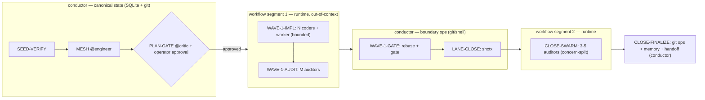

# Workflow compile-down — the Stage Graph IS the orchestration script

> **Platform feature under evaluation:** Claude Code *Dynamic Workflows*
> (research preview, 2026-05-28; requires Claude Code ≥ v2.1.154). A dynamic
> workflow is a JavaScript script Claude writes for a task, which a runtime
> executes in the background while the session stays responsive; intermediate
> results live in script variables, not the conversation context. Official
> docs: `https://code.claude.com/docs/en/workflows`.

## I. Status & scope

As of **v6.0.1 (epic #76)**, this is a **binding doctrine**. Compile-down IS the
primary execution path for gate-free agent-fanout segments, implemented as
`shctx graph compile` (#77) and wired into `dispatch-cascade.md §IV-bis` — not
behind an off-by-default toggle. Hand-rolled in-context dispatch remains the
fallback when the workflow runtime is unavailable. The §IV faithfulness contract,
the §V φ-map, and the §VI canonical-state seam are binding as written. The
decision is recorded in the v6.0.1 release notes (#71).

> **Binding model vs spike backend (v6.0.5 reconciliation).** Do not conflate two
> things this doctrine governs: (1) the compile-down **model** — the gate-free
> fan-out IS expressed as a Dynamic Workflow over subagents, plus the §IV/§V/§VI
> contracts — is **binding**; (2) the `shctx graph compile` **backend** that emits
> the workflow script is an **opt-in spike** (see the `shctx graph compile` spike +
> decision section below) whose acceptance criteria gate whether it runs by default.
> Until those criteria are met the **runtime defaults to in-context dispatch** (the
> documented fallback). Binding *intent*, opt-in *backend* — the two are consistent.

The thesis in one line: **shepherd keeps authoring and gating a static Stage
Graph; the platform runtime executes it.** shepherd contributes *discipline*
(closed flock, hard-refusal dispatch contract, audited plan, canonical state);
the platform contributes *out-of-context execution* and fan-out. The feature's
own framing — "a workflow moves the plan into code" — is shepherd's existing
`doctrines/stage-graph.md` thesis ("the plan IS the dispatch contract") executed
by a native runtime instead of walked in the conductor's working memory.

This doctrine extends `doctrines/claude-code-platform-alignment.md §VII`
(v6.0.0 line "Evaluate platform backend toggle"). That roadmap line was written
when only **Agent Teams** existed and concerned *teammate-state* delegation.
Dynamic Workflows is a **second, orthogonal backend axis** — *execution*, not
state. The two compose: Agent Teams can own teammate liveness/mailbox; a
compiled workflow can own a segment's execution. Neither subsumes the other.

## II. Two compile targets, one source

shepherd's engineer plan already has a planned *second* projection in the
backlog. Issue **#27** ("plan materialization — convert sprint plan structure
into a GH issue tree as the canonical execution manifest") and its sub-issues
**#28** (bind every dispatch to exactly one GH issue), **#29** (issue-tree
schema), and **#30** (materialization gate at INTRODUCTION close) describe
compiling the same Stage Graph into a **GitHub issue tree**.

Compile-down and plan-materialization are therefore **two compilers over one
source artifact**:

| Target | Projection of the Stage Graph | Purpose | Backlog |
|---|---|---|---|
| GH issue tree | dispatch nodes → issues; edges → dependencies | tracking + provenance + canonical manifest | #27 / #28 / #29 / #30 |
| Workflow script | agent-fanout nodes → script steps; edges → control flow | out-of-context execution + fan-out | this doctrine |

Both must satisfy the same faithfulness contract (§IV). Building them on a shared
extraction surface (`shctx plan extract`, already referenced in
`doctrines/dispatch-cascade.md`) avoids two divergent graph readers. The issue
tree is the *audit* render; the workflow script is the *executable* render.
**Neither projection may invent or drop a node the other doesn't have.**

## III. The compile unit — gate-free, agent-fanout segments

A whole sprint cannot compile to a single workflow. Three platform constraints
force segmentation:

| Constraint (from feature docs) | Consequence for shepherd |
|---|---|
| **No mid-run user input** — "for sign-off between stages, run each stage as its own workflow" | Each operator-approval boundary cuts the graph. shepherd's `PLAN-GATE` approval, `PAUSE`, and `PAUSE-FOR-DEPENDENCY` are segment boundaries, not in-workflow nodes. |
| **No direct filesystem or shell access from the workflow itself** — agents read/write/run; the script only coordinates | shepherd's conductor-inline git/shell nodes cannot live inside a workflow. They run at the conductor between segments. |
| **≤16 concurrent agents, ≤1,000 total per run** | Wide waves (large lane counts, close-swarm) must respect the concurrency cap; the compiler emits bounded `Promise.all` batches, not unbounded fan-out. |

So the **compile unit is a maximal subgraph of agent-fanout nodes bounded by
(a) operator gates and (b) conductor-inline FS/git nodes.** The conductor stitches
the segments and owns everything at the seams (§VI).



The largest context-offload win lands exactly where shepherd's pain is: the
parallel agent fan-out (impl waves, audit swarms) executes without each
intermediate result landing in the conductor's context. This is the structural
answer to several open issues — idle-teammate pruning (**#58**), tier-to-work
mismatch (**#61**), and the heavyweight pause-for-dependency mechanism (**#70**) —
because coordination moves into the script, off the conductor.

## IV. Faithfulness invariant (the correctness bar)

Compile-down is a **compiler**, so its obligation is *semantic faithfulness*:
the emitted script's observable behavior must refine the graph's specified
behavior. State the Stage Graph as a DAG

```
G = (V, E),   V = dispatch nodes,   E ⊆ V × V × Pred
```

where each edge carries a runtime predicate (`on-pass`, `on-fail`,
`on-no-drift`, …). The conductor's walk admits a set of legal execution traces
`T(G)`. Let `S = compile(G_seg)` be the script for one segment and `T(S)` the
traces its runtime produces. Restricting to the agent-fanout projection `π`, the
implementation MUST guarantee:

1. **Soundness (no invented dispatch).** `T(S) ⊆ π(T(G_seg))`. Every agent the
   script spawns maps to a node in `V_seg`; every ordering it enforces is an
   edge in `E_seg`. This is `doctrines/stage-graph.md` corollary 1 ("the
   conductor does not invent dispatches") — now *mechanically* guaranteed,
   because the script is generated *from* the critic-gated `G`, never authored
   on the fly. The platform's default "Claude writes the script for the task" is
   replaced by `compile(G)`.
1. **Completeness (no skip, no reorder).** Every must-fire node in `V_seg`
   appears in `S`, and `S`'s control flow realizes `E_seg`'s predicates. The
   compiler cannot drop `CLOSE-SWARM` or reorder a `parallel_with` pair —
   corollaries 2 and 3.
1. **Determinism modulo predicates.** Given identical predicate evaluations,
   `S`'s dispatch sequence is fixed — `pipeline.md`'s "same plan + same graph +
   same predicates → same dispatch sequence."

**Bounded dynamism is permitted, unbounded is not.** `HOTFIX-DYNAMIC` already
derives its coder count from runtime gate-error cluster analysis. Under
compile-down this maps to a loop whose iteration count is read from a prior
agent's returned analysis — legal, because the *policy* (how to derive the
count) is pre-authored in `G`; only the data-dependent *quantity* varies. This
is precisely how shepherd reconciles the platform's "subagent and iteration
counts decided in real time" with its own drift discipline: **real-time
quantity, pre-authored policy.**

Verification hook: because the operator can read the emitted script before it
runs (the launch prompt's "View raw script" / `Ctrl+G`), and because `compile`
is deterministic, a `@critic` or `@auditor` check can diff `compile(G)` against
the script the runtime is about to execute. A mismatch is a compiler bug, not a
plan defect.

## V. Node-type → script-construct map (φ)

The compiler is a structure-preserving map φ from `pipeline.md` node types to
script constructs. Conductor-inline and operator types do **not** map into the
script — they are seam nodes (§VI).

| Node type | φ(node) in the workflow script |
|---|---|
| `WAVE-IMPL` (N coders ‖ worker, `parallel_with`) | bounded `Promise.all` of agent spawns (≤16 concurrent) |
| `WAVE-AUDIT` / `CLOSE-SWARM` (M auditors, concern-split) | `Promise.all` of auditor agents → aggregate verdict object |
| `INTRO-COMBO-WAVE` (N `@discovery` ‖ M intro `@auditor`, sprint-open) | one bounded `Promise.all` mixing both roles → mesh-input bundle (`[DISCOVERY-CONTEXT]` + `[INTRO-AUDIT-CONTEXT]`) in a script variable; conductor-inline Lane 0 (patch-branch-advancement check) is a §VI seam that runs *before* the batch, never inside it |
| `DISCOVERY-COMBO-WAVE` (X `@auditor` ‖ Y `@discovery` ‖ Z `@worker`, body-phase) | one bounded `Promise.all` mixing all three roles → returned to the conductor's `BODY-AGGREGATE` (a §VI seam); auditor/discovery spawns are read-only (allowlist, §VII), worker spawns are bounded write ops |
| `DISCOVERY` (single or parallel `@discovery`; **incl. plant-mode 1–3 read-only lanes**, #119) | parallel read-only agent spawns → research bundle in a script variable. The planter's plant-mode discovery wave (1–3 `@discovery` lanes, never the flock pipeline) compiles to the SAME `Promise.all` batch shape |
| sequential edge (`on-pass` / `on-fail`) | `await` + `if` on the predecessor's returned verdict |
| `HOTFIX-DYNAMIC` | loop with count read from the upstream cluster-analysis result |
| `WORKER-IO` (bounded, non-competing) | `Promise.all` of worker agents |
| `SEED-VERIFY`, `CHAIN-REPAIR`, `PLAN-GATE`, `DEDUP-GATE`, `WAVE-GATE`, `LANE-CLOSE`, `CANONICAL-TYPES-REFRESH`, `CLOSE-FINALIZE`, `RELEASE`, `PAUSE*`, `RESUME-LANE`, `HARD-STOP` | **not compiled** — seam nodes (§VI) |

Illustrative shape only (non-binding; implementation is dispatched to `@coder`
per project policy, target language for the runtime is the platform's JS):

```js
// compile(G_seg) emits — schematic, NOT the contract
const wave1 = await Promise.all(
  lanes.map(l => agent({ subagent_type: "shepherd:coder", brief: l.brief }))
);                                            // WAVE-1-IMPL (parallel_with worker)
const audit1 = await Promise.all(
  concerns.map(c => agent({ subagent_type: "shepherd:auditor", brief: c.brief }))
);                                            // WAVE-1-AUDIT
return { wave1, audit1 };                      // results stay in script vars
```

The binding artifact is `G` and the φ table — not this snippet.

**Why the discovery waves are compile targets (faithfulness preconditions).** The
three discovery-fanout families — `INTRO-COMBO-WAVE`
(`doctrines/intro-combo-wave.md`), `DISCOVERY-COMBO-WAVE`
(`doctrines/discovery-combo-wave.md`), and the planter's plant-mode `DISCOVERY`
wave (#119) — each satisfy the §III compile preconditions and the §IV
faithfulness contract *as authored*, so they compile exactly like
WAVE-IMPL / WAVE-AUDIT / CLOSE-SWARM:

- **Gate-free.** None contains an operator-approval boundary or a conductor-inline
  FS/git node *inside* the fanout. INTRO-COMBO-WAVE's Lane 0 (patch-branch
  advancement) and the body wave's `BODY-AGGREGATE` run at the conductor *between*
  segments (§VI), not as in-batch steps — exactly the seam treatment WAVE-GATE
  gets. The fan-out itself is one uninterrupted batch.
- **Parallel-safe.** Every lane is independent by construction: discovery lanes
  are scope-partitioned (non-overlapping read targets), auditor lanes are
  concern-split, and any worker lanes are bounded write ops that cannot wait on
  audit/discovery output. No lane reads another's result before the batch
  returns, so the §IV.1 soundness and §IV.2 completeness obligations hold under a
  single `Promise.all` — this is the structural reason they may be a batch rather
  than a sequence.
- **Read-only enforced by allowlist (§VII).** Auditor and discovery spawns in
  these waves carry no edit tools; the compiler tags them `readonly` (the
  `auditor-readonly` / `discovery-readonly` graph constraint becomes a compiler
  invariant). Worker lanes in DISCOVERY-COMBO-WAVE are the only edit-capable
  spawns, and only for their declared bounded artifact.
- **Bounded.** Each wave is capped (`[stage_graph.intro_wave].parallel_max` for
  intro; `[coder].max_parallel_lanes` for the body wave; 1–3 for plant-mode), all
  well under the ≤16-concurrent / ≤1000-total ceiling — the `fanout()` chunker
  applies unchanged.

These waves therefore are **not** an exception to the compile model; they are
ordinary gate-free agent-fanout segments and were always meant to be emitted by
`shctx graph compile`, not dispatched as ad-hoc in-context Agent batches
(anti-pattern X.1). The §IV verification hook (`--verify`) diffs them the same way.

## VI. The seam — what stays at the conductor

Canonical state never moves into the runtime. The runtime's resume is
**within-session only** (completed agents return cached results; exiting Claude
Code restarts the workflow fresh), which is strictly weaker than shepherd's
durable state. Therefore:

- **SQLite registry and git remain conductor-owned** per
  `doctrines/sqlite-canonical-state.md`. The workflow runtime's progress
  tracking is a convenience, never a source of truth.
- **Operator gates run between segments**, never inside one (§III).
- **All git/shell** (`WAVE-GATE` rebase, `LANE-CLOSE`, `CLOSE-FINALIZE`)
  executes at the conductor, because the script has no FS/shell access.
- The conductor reads each segment's returned result object, writes canonical
  state, evaluates the next seam predicate, and launches the next segment.

## VII. Tensions & resolutions

| Tension | Resolution |
|---|---|
| **Auto-approved edits.** The runtime runs every spawned agent in `acceptEdits` mode and auto-approves file edits, regardless of session permission mode. This collides with `doctrines/auditor-readonly.md` (audit nodes must not write). | Read-only is enforced in the **agent brief + tool allowlist**, not via permission mode. Auditor/discovery briefs must omit write tools; the compiler must not grant edit tools to audit-type steps. The `auditor-readonly` graph constraint becomes a compiler invariant. |
| **Open-ended convergence.** The platform's pattern is "iterate until answers converge," with adversarial refutation. shepherd's dispatch is bounded and deterministic. | Keep shepherd's bounded audits. Use the convergence/refute loop only where it is already bounded by `G` (e.g., a capped `HOTFIX-DYNAMIC` cycle). Unbounded convergence violates §IV.3 determinism and is forbidden in compiled segments. |
| **Within-session resume only.** | shepherd state is canonical and survives session exit; on a fresh session the conductor re-derives position from SQLite/git and recompiles the remaining segment. Platform resume is opportunistic. |
| **`ultracode` auto-orchestration.** With `/effort ultracode`, Claude plans a workflow for *every* substantive task on its own. | Under `/shepherd:*`, orchestration shape is owned by `G`, not by ultracode. The doctrine recommends **not** running shepherd sprints under ultracode; if enabled, the compiled segments still bind, and ad-hoc workflow creation outside `G` is an anti-pattern (§X). |
| **Concurrency cap (≤16).** | The compiler emits batches sized to the cap; waves wider than 16 lanes are chunked, preserving `parallel_with` semantics within each chunk. Counts beyond 1,000 total are a plan-scale error surfaced before compile. |

## VIII. Backlog alignment

This doctrine does not stand alone in the issue tracker; it is the execution
half of work already filed:

| Open issue | Relationship to compile-down |
|---|---|
| **#27 / #28 / #29 / #30** | Sibling compiler (issue-tree projection). Share the `shctx plan extract` surface and the §IV faithfulness bar. Build the extractor once. |
| **#58** (prune idle teammates) | Out-of-context execution removes most idle-teammate cost — coordination is in the script, not held-open sessions. |
| **#61** (match tier to work) | Markdown/single-file work becomes a one-agent script step, not a conductor allocation. |
| **#70** (replace pause-for-dependency with comms substrate) | `PAUSE-FOR-DEPENDENCY` is a segment boundary; intra-segment hand-off is script control flow. Compile-down is a candidate substrate for #70. |
| **#53** (heartbeat auto-relay) | Sibling coordination that needed heartbeats can be expressed as script-level ordering within a segment. |
| **#59 / #60** (chronic gate-skipping, patch-branch advancement) | Gate nodes stay conductor-side (§VI); compiling does not weaken them, and `WAVE-GATE` remains a hard, scripted boundary. |
| **#67 / #20** | Pre-existing dispatch-contract items still open (see operator note). Compile-down depends on the v6.0.0 mandatory-`subagent_type` contract being internally consistent; resolve these first. |

## IX. Migration roadmap

Independently shippable; reverts cleanly (delete the compile path, walk the
graph as today).

**v6.0.1 — this doctrine.** No behavioral change. Records the model, the
faithfulness bar (§IV), and the seam (§VI). Cross-referenced from
`platform-alignment.md §VII` and `stage-graph.md`.

**v6.x — spike `shctx graph compile`.** On a fork: emit a workflow script for one
segment type (recommend `CLOSE-SWARM` first — pure read-only fan-out, no FS, no
operator gate, highest context-offload-per-risk). Run it behind a
`[workflows].compile_backend = false` default-off toggle in `shepherd.toml`,
mirroring the Agent-Teams toggle pattern. Add a `@critic`/`@auditor` check that
diffs `compile(G_seg)` against the runtime's raw script (§IV verification hook).

**Decision criterion.** Ship the backend as opt-in **iff** the spike shows: (a)
measurable conductor-context reduction on a real sprint; (b) the §IV diff is
clean across ≥3 sprints (no soundness/completeness violations); (c) read-only is
provably enforced via allowlist (§VII). Otherwise leave the spike as a
documented evaluation only — exactly as `platform-alignment.md §VII` leaves the
`TaskCreated`/`TaskCompleted` spike.

**Acceptance.** The release that includes the spike carries the decision either
way in its notes. Minimum Claude Code version for any compiled-backend path is
**v2.1.154** (the Dynamic Workflows floor); `commands/spawn.md` Check 2 gains a
conditional bump when `compile_backend = true`.

## X. Anti-patterns

1. **Letting Claude write the orchestration script ad hoc under `/shepherd:*`.**
   The script must be `compile(G)`, where `G` is critic-gated. Free-form workflow
   authoring bypasses PLAN-GATE and violates §IV.1.
1. **Compiling a whole sprint into one workflow.** Ignores operator gates and
   FS/shell seams (§III). Segments cut at gates and conductor-inline nodes.
1. **Treating the runtime's progress as canonical.** SQLite/git stay canonical
   (§VI); per `sqlite-canonical-state.md §Anti-patterns`.
1. **Granting edit tools to audit-type steps because the runtime auto-approves
   edits.** Read-only is an allowlist invariant (§VII); the auto-approve default
   does not relax `auditor-readonly.md`.
1. **Running shepherd sprints under `/effort ultracode`** and letting it spawn
   workflows outside `G`. Orchestration shape is owned by the plan.
1. **Building a second graph reader for the workflow projection** instead of
   sharing the #27 extractor. One source, two faithful projections (§II).

## XI. What this doctrine does NOT do

- It does not open the closed flock. As of v6.0.1 (epic #76), compile-down IS
  the primary execution path for gate-free fanout segments via `shctx graph
  compile`; hand-rolled in-context dispatch is the fallback on
  workflow-runtime unavailability. The six domain agents and three
  meta-orchestrators (root shepherd, conductor, planter) are unchanged; the
  runtime executes the same roles.
- It does not delegate canonical state to the platform. SQLite/git stay
  shepherd-owned.
- It does not mandate Dynamic Workflows. The default remains the
  conductor-walked graph; compile-down is an opt-in backend pending the §IX
  decision.
- It does not author implementation. Code is dispatched to `@coder`.

## XII. References

### Shepherd-side

- `doctrines/stage-graph.md` — the plan IS the dispatch contract; corollaries 1–3 are §IV.1–3.
- `skills/shepherd/pipeline.md` — node taxonomy and walk algorithm; source of the φ map (§V).
- `doctrines/claude-code-platform-alignment.md §VII` — backend-toggle roadmap; this doctrine is the orthogonal execution axis.
- `doctrines/dispatch-cascade.md` — `shctx plan extract` / `graph mark`; shared extraction surface (§II).
- `doctrines/sqlite-canonical-state.md` — canonical-state boundary (§VI).
- `doctrines/auditor-readonly.md` — read-only invariant under auto-approved edits (§VII).
- `doctrines/dispatch-tier-separation.md` — mandatory `subagent_type` contract the compiled steps must honor.
- Backlog: #27, #28, #29, #30 (issue-tree sibling); #58, #61, #70, #53 (orchestration-load); #59, #60 (gate enforcement); #67, #20 (dispatch-contract prerequisites).

### Platform-side

- `https://code.claude.com/docs/en/workflows` — Dynamic Workflows: script-writes-the-plan model, no-mid-run-input, no-FS/shell, ≤16 concurrent / ≤1,000 total, within-session resume, `acceptEdits` for spawned agents, `/config` + `disableWorkflows` + `CLAUDE_CODE_DISABLE_WORKFLOWS` controls, v2.1.154 floor.
- `https://code.claude.com/docs/en/sub-agents` — the worker primitive workflows orchestrate.
- `https://code.claude.com/docs/en/agent-teams` — the orthogonal teammate-state backend (`platform-alignment.md`).
